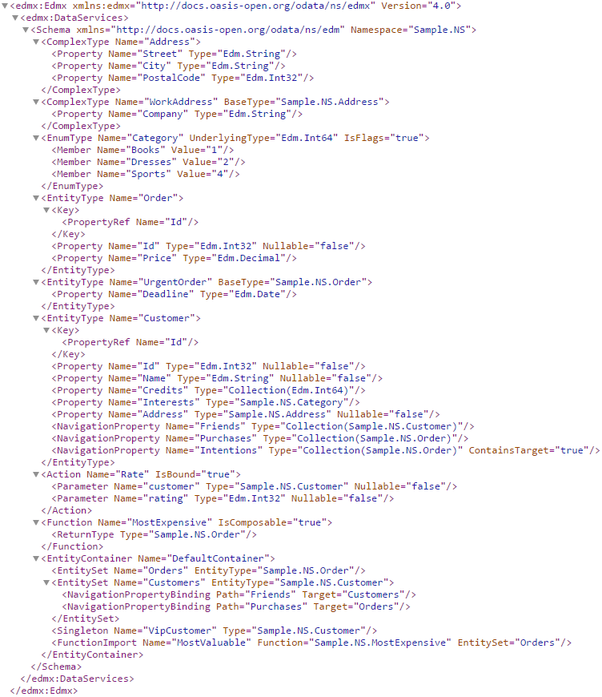

EdmLib supports defining all types of operations (**actions** or **functions**) and operation imports (**action imports** or **function imports**). Besides the conceptual difference between actions and functions, the way to define them could actually be shared among actions and functions.

This section shows how to define operations and operation imports using EdmLib APIs. We will continue to use and extend the sample from the previous sections.

### Add a Bound Action *Rate*
In the **SampleModelBuilder.cs** file, add the following code into the `SampleModelBuilder` class:

``` csharp
namespace EdmLibSample
{
    public class SampleModelBuilder
    {
        ...
        private EdmAction _rateAction;
        ...
        public SampleModelBuilder BuildRateAction()
        {
            _rateAction = new EdmAction("Sample.NS", "Rate",
                returnType: null, isBound: true, entitySetPathExpression: null);
            _rateAction.AddParameter("customer", new EdmEntityTypeReference(_customerType, false));
            _rateAction.AddParameter("rating", EdmCoreModel.Instance.GetInt32(false));
            _model.AddElement(_rateAction);
            return this;
        }
        ...
    }
}
```

Then in the **Program.cs** file, insert the following code into the `Main` method:

``` csharp
namespace EdmLibSample
{
    class Program
    {
        public static void Main(string[] args)
        {
            var builder = new SampleModelBuilder();
            var model = builder
                ...
                .BuildCustomerType()
#region         !!!INSERT THE CODE BELOW!!!
                .BuildRateAction()
#endregion
                ...
                .GetModel();
            WriteModelToCsdl(model, "csdl.xml");
        }
    }
}
```

This code:

 - Defines a **bound action** `Rate` within the namespace `Sample.NS` with **no return type**;
 - Adds a **binding parameter** `customer` of type `Sample.NS.Customer`;
 - Adds a parameter `rating` of type `Edm.Int32`;
 - Adds the `Sample.NS.Rate` action to the model.
 <br />

### Add an Unbound Function *MostExpensive*
In the **SampleModelBuilder.cs** file, add the following code into the `SampleModelBuilder` class:

``` csharp
namespace EdmLibSample
{
    public class SampleModelBuilder
    {
        ...
        private EdmFunction _mostExpensiveFunction;
        ...
        public SampleModelBuilder BuildMostExpensiveFunction()
        {
            _mostExpensiveFunction = new EdmFunction("Sample.NS", "MostExpensive",
                new EdmEntityTypeReference(_orderType, true), isBound: false, entitySetPathExpression: null, isComposable: true);
            _model.AddElement(_mostExpensiveFunction);
            return this;
        }
        ...
    }
}
```

Then in the **Program.cs** file, insert the following code into the `Main` method:

``` csharp
namespace EdmLibSample
{
    class Program
    {
        public static void Main(string[] args)
        {
            var builder = new SampleModelBuilder();
            var model = builder
                ...
                .BuildRateAction()
#region         !!!INSERT THE CODE BELOW!!!
                .BuildMostExpensiveFunction()
#endregion
                ...
                .GetModel();
            WriteModelToCsdl(model, "csdl.xml");
        }
    }
}
```

This code:

 - Defines an **unbound composable function** `MostExpensive` within the namespace `Sample.NS`;
 - Has **no parameter**;
 - Adds the `Sample.NS.MostExpensive` action to the model.
 <br />

### Add a Function Import *MostValuable*
In the **SampleModelBuilder.cs** file, add the following `using` clause:

``` csharp
using Microsoft.OData.Edm.Library.Expressions;
```

Then add the following code into the `SampleModelBuilder` class:

``` csharp
namespace EdmLibSample
{
    public class SampleModelBuilder
    {
        ...
        private EdmFunctionImport _mostValuableFunctionImport;
        ...
        public SampleModelBuilder BuildMostValuableFunctionImport()
        {
            _mostValuableFunctionImport = _defaultContainer.AddFunctionImport("MostValuable", _mostExpensiveFunction, new EdmEntitySetReferenceExpression(_orderSet));
            return this;
        }
        ...
    }
}
```

And in the **Program.cs** file, insert the following code into the `Main` method:

``` csharp
namespace EdmLibSample
{
    class Program
    {
        public static void Main(string[] args)
        {
            var builder = new SampleModelBuilder();
            var model = builder
                ...
                .BuildVipCustomer()
#region         !!!INSERT THE CODE BELOW!!!
                .BuildMostValuableFunctionImport()
#endregion
                .GetModel();
            WriteModelToCsdl(model, "csdl.xml");
        }
    }
}
```

This code:

 - Directly adds a **function import** `MostValuable` into the default container;
 - Lets the function import return a `Sample.NS.Order` from and **limited to** the entity set `Orders`;
 <br />
 
The `Sample.NS.MostValuable` function import is actually the `Sample.NS.MostExpensive` function exposed in the entity container with a **different name** (could be **arbitrary valid name**).

### Run the Sample
Build and run the sample. Then open the **csdl.xml** file under the **output directory**. The content of **csdl.xml** should look like the following:

