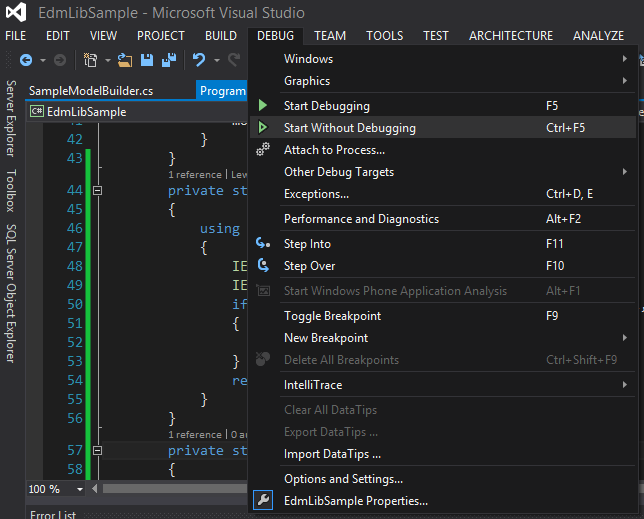
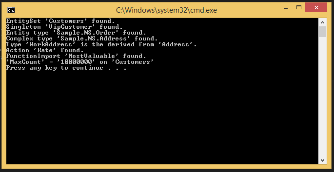

The model utilities are made up of many useful **extension methods** to various EDM classes and interfaces (e.g., IEdmModel, IEdmType, ...). The extension methods are intended to implement some **commonly reusable** logic to simplify the code handling the entity data models. These methods can be roughly classified into five categories:

 - **Searching**. The naming convention is `Find<ElementName>` (e.g., `IEdmModel.FindDeclaredType()`);
 - **Predicate**. The naming convention is `Is<ElementName>` (e.g., `IEdmOperation.IsFunction()`);
 - **Information**. The naming convention is `<InformationName>` (e.g., `IEdmNavigationSource.EntityType()`);
 - **Getter**. The naming convention is `Get<Name>` (e.g., `IEdmModel.GetTermValue<T>`);
 - **Setter**. The naming convention is `Set<Name>` (e.g., `IEdmModel.SetEdmVersion`).
  

The mostly used parts are **Searching**, **Predicate** and **Information**. The extension methods of the latter two parts are trivial because they work literally as their names imply. So this section will mainly cover **Searching**. We will continue to use and extend the sample from the previous sections.

### Add the Sample Code
In the **Program.cs** file, insert the following code into the `Program` class:


namespace EdmLibSample
{
    class Program
    {
        public static void Main(string[] args)
        {
            ...
            WriteModelToCsdl(model, "csdl.xml");
#region     !!!INSERT THE CODE BELOW!!!
            TestExtensionMethods(model);
#endregion
            var model1 = ReadModel("csdl.xml");
            ...
        }
        ...
        private static void TestExtensionMethods(IEdmModel model)
        {
            // Find an entity set.
            var customerSet = model.FindDeclaredEntitySet("Customers");
            Console.WriteLine("{0} '{1}' found.", customerSet.NavigationSourceKind(), customerSet.Name);
            // Find any kind of navigation source (entity set or singleton).
            var vipCustomer = model.FindDeclaredNavigationSource("VipCustomer");
            Console.WriteLine("{0} '{1}' found.", vipCustomer.NavigationSourceKind(), vipCustomer.Name);
            // Find a type (complex or entity or enum).
            var orderType = model.FindDeclaredType("Sample.NS.Order");
            Console.WriteLine("{0} type '{1}' found.", orderType.TypeKind, orderType.FullName());
            var addressType = model.FindDeclaredType("Sample.NS.Address");
            Console.WriteLine("{0} type '{1}' found.", addressType.TypeKind, addressType);
            // Find derived type of some type.
            var workAddressType = model.FindAllDerivedTypes((IEdmStructuredType)addressType).Single();
            Console.WriteLine("Type '{0}' is the derived from '{1}'.", ((IEdmSchemaType)workAddressType).Name, addressType.Name);
            // Find an operation.
            var rateAction = model.FindDeclaredOperations("Sample.NS.Rate").Single();
            Console.WriteLine("{0} '{1}' found.", rateAction.SchemaElementKind, rateAction.Name);
            // Find an operation import.
            var mostValuableFunctionImport = model.FindDeclaredOperationImports("MostValuable").Single();
            Console.WriteLine("{0} '{1}' found.", mostValuableFunctionImport.ContainerElementKind, mostValuableFunctionImport.Name);
            // Find an annotation and get its value.
            var maxCountAnnotation = (IEdmValueAnnotation)model.FindDeclaredVocabularyAnnotations(customerSet).Single();
            var maxCountValue = ((IEdmIntegerValue)maxCountAnnotation.Value).Value;
            Console.WriteLine("'{0}' = '{1}' on '{2}'", maxCountAnnotation.Term.Name, maxCountValue, ((IEdmEntitySet)maxCountAnnotation.Target).Name);
        }
    }
}


### Run the Sample
From the **DEBUG** menu, click **Start Without Debugging** to build and run the sample. The console window should **not** disappear after program exits.

The output of the console window should look like the following:

