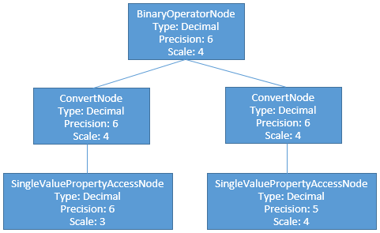

Class `ODataUri` has two properties `Filter` and `OrderBy` that are tree data structures representing part of the URI parsing result. [Precision](http://docs.oasis-open.org/odata/odata/v4.0/errata03/os/complete/part3-csdl/odata-v4.0-errata03-os-part3-csdl-complete.html#_Toc453752531) and [scale](http://docs.oasis-open.org/odata/odata/v4.0/errata03/os/complete/part3-csdl/odata-v4.0-errata03-os-part3-csdl-complete.html#_Toc453752532) are two [type facets](http://docs.oasis-open.org/odata/odata/v4.0/errata03/os/complete/part3-csdl/odata-v4.0-errata03-os-part3-csdl-complete.html#_Toc453752528) for certain primitive types. When an operation is applied to types with different facets, they will first be converted to a common type with identical facets. The common type is also the type for the result of the operation. This conversion will appear as one or more convert nodes in the resulting tree. The question is, what are the type facets conversion/promotion rules?

In the library, the rules are customizable. The interface is formulated by the following class:


public class TypeFacetsPromotionRules
{
    public virtual int? GetPromotedPrecision(int? left, int? right);
    public virtual int? GetPromotedScale(int? left, int? right);
}


The first method defines the rule to resolve two precision values `left` and `right` to a common one, while the second is for scale values. The class provides a default implementation for the methods, which works as the default conversion rules. To customize the rules, you subclass and override the relevant methods as necessary.

The default conversion rule (for both precision and scale) is as follows:

1. if both `left` and `right` are `null`, return `null`;
2. if only one is `null`, return the other;
3. otherwise, return the larger.

You plugin a specific set of conversion rules by setting the `ODataUriResolver.TypeFacetsPromotionRules` property that has a declared type of `TypeFacetsPromotionRules`. If not explicitly specified by the user, an instance of the base class `TypeFacetsPromotionRules` will be used by default.

Let's see a simple example. Consider the expression `Decimal_6_3 mul Decimal_5_4` where `Decimal_6_3` and `Decimal_5_4` are both structural properties of `Edm.Decimal` type. The former has precision 6 and scale 3, while the latter has 5 and 4. Using the default conversion rules, the result would be:

